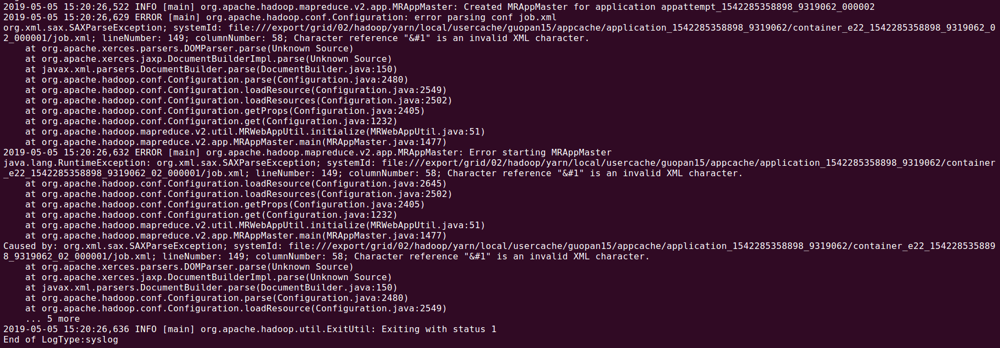

# MR 任务配置中的 \x001

## 场景

* mapreduce 任务，读取 hive，表数据时，是直接读取 hive 表在 hdfs 上的文件的；
    而因为 hive 表在建表时，可以指定字段分隔符，因此该分隔符最好做成可配的

## 问题

* hive 中默认的字段分隔符为 ascii码 的 001，即为 `\001`
    * 而如果将该 `\001` 配置在 mapreduce 的 Configuration 对象中，然后在 map/reduce 阶段从 context 中读取出来，
        即会出现以下报错
    

## 根源

* 猜测
    * mapreduce 任务的 Configuration 对象在接收到配置之后，将会把这些配置信息序列化然后保存到 job.xml 中，
        然后下发给其他各个不同的节点，由每个 container 重新读取出来
    * 而序列化时，部分特殊字符序列化到文件中之后，可能会存在解析时的问题

## 解决方案

1. 建表时使用其他的分隔符

2. mapreduce的job初始化阶段传入分隔符时，对其进行编码；在map/reduce阶段读取后对其进行解码

