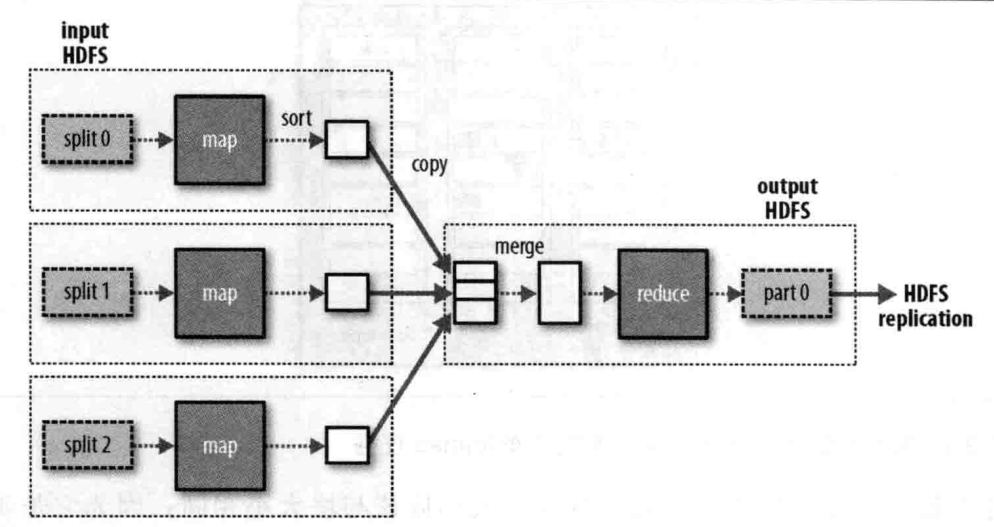
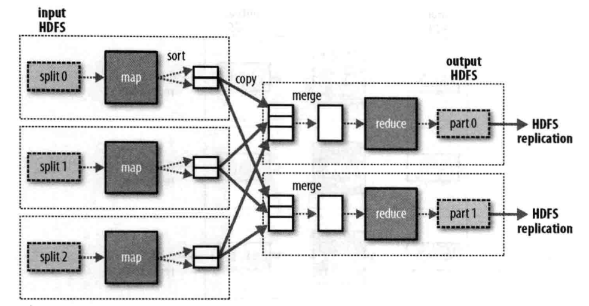

# 关于 MapReduce


### Map 和 Reduce

* MapReduce 任务过程分为两个处理阶段: map 阶段和 reduce 阶段。每个阶段都以键值对作为输入和输出，其类型由开发人员选择

* Hadoop 本身提供了一套可优化网络序列化传输的基本类型，而不直接使用 Java 内嵌类型
    * 这些类型都在 `org.apache.hadoop.io` 包中

* 在编写 MapReduce 程序的过程中，我们最先需要实例化一个 Job 对象，下面的代码简单描述了 Job 的创建以及配置过程

```java
public class MaxTemperature{
    public static void main(String[] args) throws Exception{
        // job 对象指定作业执行规范，我们可以通过它来控制整个作业的运行
        Job job = new Job();

        // 我们在 Hadoop 集群上运行这个作业时，要把代码打包成一个 jar 包。
        // 并不需要明确指定 jar 文件的名称，而是在 job 对象的 setJarByClass 指定一个类即可。
        // Hadoop 将会利用这个类来查找包含他的 jar 文件
        job.setJarByClass( MaxTemperature.class );
        job.setJobName( "Max Temperature" );

        // 指定输入输出路径，这个路径可以是一个目录，也可以是一个文件，或则符合文件模式的一系列文件
        // 可以有多个输入路径，但是只能有一个输出路径。
        // 在运行作业前该输出目录或则文件不应该存在，否则 Hadoop 会报错并拒绝执行作业（这是为了防止覆盖掉以前运行的输出数据）
        FileInputFormat.addInputPath( job, new Path(args[0]) );
        FileOutputFormat.setOutputPath( job, new Path(args[1]) );

        // 指定 mapper 和 reducer
        job.setMapperClass( MaxTemperatureMapper.class );
        job.setReducerClass( MaxTemperatureReducer.class );

        // 通过 setOutputKeyClass,setOutputValueClass 来控制 map 和 reduce 函数输出类型
        // 这两个输出类型一般是相同的。如果不同，可以使用 setMapOutputKeyClass,setMapOutputValueClass 来进行设置
        job.setOutputKeyClass( Text.class );
        job.setOutputValueClass( IntWritable.class );

        // 调用 job.waitForCompletion(true) 将会以阻塞的方式运行 mr 任务，直到人物运行结束才会返回。
        System.exit( job.waitForCompletion(true) ? 0 : 1 );
    }
}
```


### 横向扩展

* 我们在开发调试 MR 程序时，一般会在本地构建较小的数据集（通常是一个文件），然后执行。
    而在实际运行时，我们通常把待处理的数据放到 HDFS 上

* Hadoop 将作业分为若干个小任务(task)来执行，其中包括两类任务: map 任务和 reduce 任务

* jobtracker 和 tasktracker
    * Hadoop 集群上将会存在一个 jobtracker 以及多个 tasktracker 
    * jobtracker 通过调度 tasktracker 上运行的任务来协调所有运行在系统上的作业。如果某任务失败，则 jobtracker 将会在另一个 tasktracker 节点上重新调度该任务
    * tasktracker: 在运行任务的同时将运行进度报告发送给 jobtracker

* 分片
    * Hadoop 将 MapReduce 的输入数据划分为等长的小数据块，称为输入分片。
    * Hadoop 为每个分片构建一个 map 任务，并由该任务来运行用户自定义的 map 函数从而处理分片中的记录
    * 因此在 map 阶段，某次 map 函数调用过程中抛出没有处理的异常，会导致该分片内后续的数据丢失（不会再被 map 函数处理）。
    * 分片的大小
        * 如果每个分片数据比较小，那么整个处理过程将会获得更好的负载均衡(更容易调度)
        * 但是如果分片过小，那么管理分片的总时间和构建 map 的总时间将会决定作业的执行时间
        * 因此对于大多数作业来说，一个合理的分片大小趋近于 HDFS 的一个块的大小，默认是 64KB 


* 一个 reduce 任务的 MapReduce 的数据流



* 多个 reduce 任务的 MapReduce 的数据流



* 无 reduce 任务的 MapReduce 的数据流


* map 任务
    * Hadoop 在存储有输入数据(HDFS 中的数据)的节点上运行 map 任务时，将会获得最佳性能，即 "数据本地化优化"，因为它无需使用集群带宽资源
    * 这也是最佳分片的大小应该与块大小一致的原因: 它是确保可以存储在单个节点上的最大输入块的大小。
    * map 任务将其输出写入本地磁盘

* reduce 任务
    * reduce 任务并不具备数据本地化优势。因为单个 reduce 的输入通常来源于所有 mapper 的输出，因此必须通过网络传输将 mapper 的输出汇总到一起
    * reduce 的输出通常会写入 HDFS 进行永久存储
    * reduce 任务的数量并非由输入数据的大小决定，而是独立指定的
    * 如果有多个 reduce 任务，则每个 map 任务将会针对输出进行分区(partition)，即为每个 reduce 任务创建一个分区。
        每个分区都包含许多键，但同一 mapper 任务输出的相同键都会放到一个分区中。
        分区由用户定义的 partition 控制，但通常使用默认的 partitioner 通过哈兮函数来分区(比较高效)

* combiner 函数
    * 集群上的可用带宽限制了 MapReduce 作业的数量，因此尽量避免 map 和 reduce 任务之间的数据传输是有必要的。
    * Hadoop 允许用户针对 map 任务的输出指定一个 combiner 函数，该 combiner 函数的输出作为 reduce 函数的输入
    * 举例说明 combiner 函数的作用
    ```
    # 比如要求取某年的最高温度
    # 无 combiner 的情况
        # mapper1 的输出
        (1950,10)
        (1950,20)
        (1950,30)
        # mapper2 的输出
        (1950,15)
        (1950,25)
        # reduce 的输入
        (1950,[10,15,20,25,30])
    # 有 combiner 的情况
        # mapper1 的输出
        (1950,10)
        (1950,20)
        (1950,30)
        # combiner1 的输出
        (1950,30)
        # mapper2 的输出
        (1950,15)
        (1950,25)
        # combiner2 的输出
        (1950,25)
        # reduce 的输入
        (1950,[25,30])
    # 因此它可以有效减少 map 的数据发送到 reduce 的数据量的大小
    # 但是并非所有情况都适合使用 combiner ，比如要求取某年的平均气温，就不适合使用 combiner
    ```
    * 在代码中指定一个 combiner
    ```java
    // 实际上 combiner 做的事情和 reducer 做的很像，只是 combiner 只在当前 mapper 的输出上进行 reduce 操作
    job.setCombinerClass( MaxTemperatureReducer.class );
    ```


### Hadoop Streaming

* Hadoop 提供了 MapReduce 的 API，允许使用非 java 语言来实现自己的 map 和 reduce

* python 版本

```python
##### map.py
import sys
import random

def get_randint():
    return random.randint(10,100)

for line in sys.stdin:
    print '%s\t%s' % (get_randint(),line.split(':')[-1])
```
```python
##### reduce.py
import sys

lines = []
cur_key = None

def execute_data( key,values ):
    print key,max( values )

for line in sys.stdin:
    # 经过 cat xxx.txt | python map.py 之后的输出会多出大量的空行(暂时不知道为啥)，因此将其排除掉
    if len(line) <= 1:
        continue
    key,value = line.split('\t')

    if cur_key == None:
        cur_key = key
    if cur_key != key:
        execute_data( cur_key,lines )
        cur_key = key
        lines = [value]
    else:
        lines.append( value )
```
```bash
# 执行
$ cat xxx.txt | python map.py | sort | python reduce.py
```


### Hadoop Pipes

* Hadoop Pipes 是 Hadoop MapReduce 的 C++ 接口，它使用了套接字作为 tasktracker 和 C++ 版本 map 函数或 reduce 函数进程之间的通道


