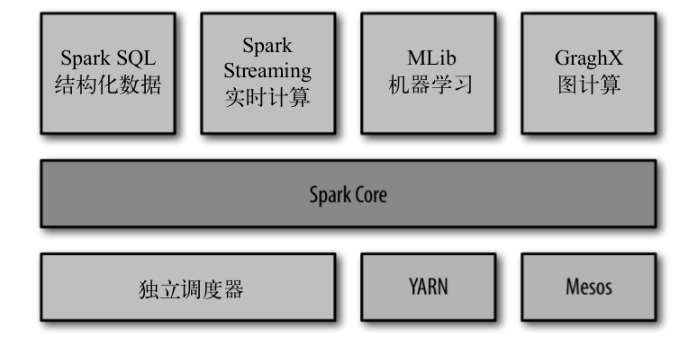

# Spark 数据分析导论

### Spark 是什么

* Spark 是一个用来实现快速而通用的集群计算的平台
    * 速度方面， Spark 扩展了 MapReduce 计算模型，而且高效地支持更多计算模式，包括交互式查询和流处理
    * 它的一个主要特点就是在内存中进行计算，因而更快。而且即使是必须在磁盘上进行的复杂操作，也依然会比 MapReduce 更快

* Spark 适用于各种各样的场景，包括
    * 批处理
    * 流处理
    * 迭代算法
    * 交互式查询

* Spark 提供了丰富的接口
    * 提供基于 Python Java Scala 和 SQL 的简单易用的 API
    * 也可以和其他大数据工具紧密配合使用，如可以运行在 Hadoop 上，访问包括 Cassandra 在内的任意 Hadoop 数据源

### 一个大一统的软件栈

* Spark 各个组件的关系

* Spark Core
    * Spark Core 实现了 Spark 的基本功能，包含任务调度、内存管理、错误恢复以及存储系统交互模块
    * Spark Core 还包含了对弹性分部署数据集（resilient distributed datase, RDD）的API定义
    * RDD 表示分布在多个计算节点上可以并行操作的元素集合，是 Spark 主要的操作对象

* Spark SQL
    * Spark SQL 是 Spark 用来操作结构化数据的程序包
        * 通过它，我们可以使用 SQL 或者 HQL 来查询数据
    * Spark SQL 支持开发者将 SQL 和传统的 RDD 编程的数据操作方式相结合
        * 无论是使用 Python,Java,Scala 开发者都可以在单个应用中同时使用 SQL 和复杂的数据分析

* Spark Streaming
    * Spark Streaming 是 Spark 提供的对实时数据进行流式计算的组件（比如生产环境中的网页服务器日志...）
    * Spark Streaming 提供了用来操作数据流的 API，并与 Spark Core 中的 RDD API 高度对应
    * 从底层设计来看，它支持与 Spark Core 同级别的容错性、吞吐量以及可伸缩性

* MLlib
    * 常见的机器学习( ML )功能的库
        * 该库提供了很多机器学习的算法，包括分类、回归、聚类、协同过滤等
        * 以及模型评估、数据导入等额外的功能支持

* GraphX
    * GraphX 是用来操作图(比如社交网络的朋友关系图)的程序库，可以进行并行的图计算
    * GraphX 也扩展了 Spark 的 RDD API ，能用来创建一个定点和边都包含任意属性的有向图
    * GraphX 还支持针对图的各种操作

### 集群管理器

* 就底层而言， Spark 设计为可以高效的在一个计算节点到多个计算节点之上运行。
    为了支持这个特性， Spark 支持在各种集群管理器上运行，包括
    * Hadoop Yarn
    * Apache Mesos
    * Spark 自带的一个简易调度器: 独立调度器(适合)

### Spark 的存储层次

* Spark 不仅可以将任何 Hadoop 分布式文件系统(HDFS)上的文件读取为分布式数据集，
    也可以支持其他支持 Hadoop 接口的系统，比如: 本地文件、亚马逊S3、Cassandra、Hive、HBase

* Hadoop 并非是 Spark 的必要条件

