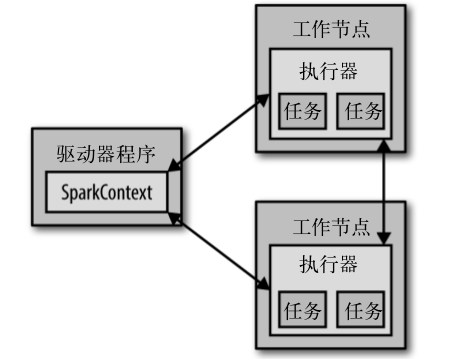

# Spark 下载与入门

* 从网上下载 Spark 的发布包到本地，并解压

## 简单实例

* 启动一个 Python 版本的 Spark Shell

```bash
$ ./bin/pyspark
>>> lines = sc.textFile('README.md')        # 创建一个名为 lines 的 RDD
>>> lines.count()                           # 统计 RDD 中的元素个数
>>> lines.first()                           # 获取 RDD 中的第一个元素
```

## Spark 核心概念简介

* 从上层来看，每个 Spark 应用都有一个驱动器程序(driver program)来发起集群上的各种并行操作
    * 驱动器程序包含应用的 main 函数，并且定义了集群上的分布式数据集，还对这些分布式数据集应用了相关操作
    * 对于之前的 pyspark ，驱动器程序就是 Spark Shell 本身

* 驱动器通过一个 SparkContext 对象来访问 Spark。这个对象代表对计算集群的一个连接
    * pyspark 启动时自动创建了一个 SparkContext 对象，是一个叫做 sc 的变量

* 我们可以通过 SparkContext 来创建 RDD
    * 如上面的程序，我们通过 `sc.textFile()` 由一个本地文件创建了一个 RDD，之后可以在这个 RDD 上进行其他操作，比如 count 等
    * 要执行 count 操作，驱动器程序一般要管理多个执行器(executor)节点，由多个 executor 节点分别计算文件的不同部分的行数，最后再进行汇总

* 驱动器与执行器的简单关系图



```bash
$ ./bin/pyspark
>>> lines = sc.textFile('README.md')                            # 创建一个名为 lines 的 RDD
>>> python_lines = lines.filter(lambda line: 'Python' in line)  # 筛选包含 Python 字符串的行，将其汇总。注意这里的 python_lines 是一个新的 RDD
>>> python_lines.first()                                        # 获取 RDD 中的第一个元素
```

## 独立应用

* 提交脚本 `./bin/spark-submit my_script.py` 到 Spark 集群上运行

* 初始化 Spark 的 SparkContext
    * 在 Python 中初始化 Spark

    ```python
    from pyspark import SparkConf, SparkContext
    # 链接集群
    conf = SparkConf().setMaster("local").setAppName("My App")
    sc = SparkContext(conf = conf)
    # 退出应用
    sys.exit()
    ```

    * 在 Java 中初始化 Spark
    ```java
    import org.apache.spark.SparkConf;
    import org.apache.spark.api.java.JavaSparkContext;
    // 链接集群
    SparkConf conf = new SparkConf().setMaster("local").setAppName("My App");
    JavaSparkContext sc = new JavaSparkContext(conf);
    // 退出应用
    System.exit(0)
    ```
    * 以上两种方式，是创建 SparkContext 的最基本的方法，只需要传递下面两个参数
        * 集群 URL: 告诉 Spark 如何连接到集群上(使用 local 可以让 Spark 运行在单机单线程而无需连接到集群上)
        * 应用名

* 构建独立应用(单词计数)

```java
// 生成 SparkContext 对象
SparkConf conf = new SparkConf().setMaster("local").setAppName("wordCount");
JavaSparkContext sc = new JavaSparkContext(conf);
// 读取我们的输入数据
JavaRDD<String> input = sc.textFile(INPUTE_FILE);
// 切分为单词
JavaRDD<String> words = input.flatMap(
        new FlatMapFunction<String, String>() {
            @Override
            public Iterable<String> call(String x) {
                return Arrays.asList(x.split(" "));
            }
        }
);
// 转换为键值对并计数
JavaPairRDD<String, Integer> counts = words.mapToPair(
        new PairFunction<String, String, Integer>() {
            @Override
            public Tuple2<String, Integer> call(String x) {
                return new Tuple2(x, 1);
            }
        }
).reduceByKey(new Function2<Integer, Integer, Integer>() {
            @Override
            public Integer call(Integer x, Integer y) {
                return x + y;
            }
        }
);
// 将统计出来的单词总数存入一个文本文件,引发求值
counts.saveAsTextFile(OUTPUT_FILE);

```
