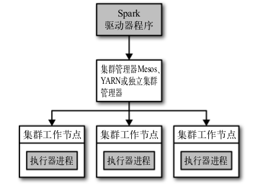

# 在集群上运行 Spark

## Spark 运行时架构

* 在分布式环境下，Spark 集群采用的是主/从结构。在一个 Spark 集群中
    * 有一个节点负责中央协调，调度各个分布式工作节点。这个中央节点被称为驱动器 (Driver) 节点
    * 与之对应的工作节点被称为执行器(Executor)节点
    * Driver 节点可以和大量的 Executor 节点进行通信，它们也都作为独立的 Java 进程运行
    * Driver 节点和所有 Executor 节点一起被称为一个 Spark 应用(Application)



* Spark 应用通过一个叫做集群管理器(Cluster Manager)的外部服务在集群的机器上启动
    * Spark 自带一个集群管理器，被称为独立集群管理器
    * Spark 也可以运行在 Hadoop YARN 和 Apache Mesos 这两大开源集群管理器上

### 驱动器节点

* Spark 驱动器时执行你的程序中 main() 方法的进程。它执行用户编写的用来创建 SparkContext，创建 RDD，以及进行 RDD 的转化操作和行动操作的代码

* Spark 驱动器程序在 Spark 应用中有两个职责
    * 把用户程序转换为任务
        * Spark 驱动器程序负责把用户程序转换为多个物理执行的单元，这些单元也被称之为任务
        * 从上层看，所有的 Spark 程序都遵循同样的结构: 程序从输入数据创建一系列 RDD，再使用转化操作派生出新的 RDD，最后使用行动操作收集或者存储 RDD
        * Spark 程序实际上隐式地创建了一个由操作逻辑组成的有向无环图(Directed Acyclic Graph，DAG)
        * Spark 会对执行计划做一些优化，比如将连续的映射转换为流水线化执行，将多个操作合并到一个步骤中。
            如此， Spark 将逻辑计划转换为一系列步骤(stage)；每个步骤都由多个任务组成。
        * 任务是 Spark 中最小的工作单元

    * 为执行器节点调度任务
        * 有了物理执行计划之后，Spark 驱动器程序必须在各个执行器进程之间协调任务的调度。
        * 执行器进程启动后，会向驱动器进程注册自己。因此驱动器进程始终对应用中所有的执行器节点有完整的记录
        * 每个执行器节点代表一个能够处理任务和存储RDD数据的进程
        * 驱动器程序会将一些 Spark 应用的运行时的信息通过网页界面呈现出来，默认在端口 4040

### 执行器节点

* Spark 执行器节点是一种工作进程，负责在 Spark 作业中运行任务，任务之间相互独立。

* Spark 应用启动时，执行器节点就被同时启动，并始终伴随着整个 Spark 应用的生命周期而存在
    * 如果执行器节点发生异常或崩溃，Spark应用也可以继续执行

* Spark 执行器的两个作用
    * 负责运行组成 Spark 应用的任务，并将结果返回给驱动器进程
    * 通过自身的块管理器(Block Manager)为用户程序中要求缓存的 RDD 提供内存式存储
        * RDD 是直接缓存在执行器进程内的，因此任务可以在运行时充分利用缓存数据加速运算

### 集群管理器

* Spark 依赖于集群管理器来启动执行器节点，而在某些特殊情况下，也依赖集群管理器来启动驱动器节点

* Spark 文档中常常有下面的描述，请注意不要混淆
    * 以 `驱动器节点` 和 `执行器节点` 的概念来描述Spark应用中的进程
    * 以 `主节点(master)` 和 `工作节点(worker)` 的概念来描述集群管理器中的中心化部分和分布式部分
    * 例如
        * YARN 会启动一个叫做 Resouce Manager 的主节点进程，以及一系列 Node Manager 的工作节点进程

## 使用 spark-submit 部署应用

* spark-submit 的使用方式: `./bin/spark-submit [options] <app jar | python file> [app options]`
    * `options` 是要传给 spark-submit 的标记列表，可以通过 `./bin/spark-submit --help` 列出所有可以接受的标记
    * `<app jar | python file>` 表示包含应用入口的 jar 包或者 python 脚本
    * `[app options]` 是传给你的应用的选项，即传递给入口类的 main 方法的参数列表

* `options` 的常见标记

| 标记 | 描述 |
|:----|:----|
| --master          | 表示要连接的集群管理器，详细可以看下面 |
| --deploy-mode     | 选择在本地('client')启动驱动器程序，还是在集群中的一台工作节点机器('cluster')上启动。在客户端模式下， spark-submit 会将驱动器程序运行在 spark-submit 被调用的这台机器上；在集群模式下，驱动器程序会被传输并执行于集群的一个工作节点上。默认是本地模式 |
| --class           | 运行 java 或者 Scala 程序时应用的主类 |
| --name            | 应用的显示名，会显示在 Spark 的网页用户界面中 |
| --jars            | 需要上传并放到应用的 CLASSPATH 中的 JAR 包的列表。如果应用依赖少量的第三方包，可以将它们放到这个参数中 |
| --files           | 需要放到应用工作目录中的文件的列表。这个参数一般用来放需要分发到各节点的数据文件 |
| --py-files        | 需要添加到 PYTHONPATH 中的文件的列表。其中可以包括 .egg 文件和 .zip 文件 |
| --executor-memory | 执行器进程使用的内存量，以字节为单位。可以使用后缀指定更大的单位，比如 '512m'(512 MB)或'15g'(15 GB) |
| --driver-memory   | 驱动器进程使用的内存量，以字节为单位。可以使用后缀指定更大的单位，比如 '512m'(512 MB)或'15g'(15 GB) |


* `--master` 可以接受的值

| 值 | 描述 |
|:---|:---|
| spark://host:port | 连接到指定端口的 Spark 独立集群上，默认情况下 Spark 独立主节点使用 7077 端口 |
| mesos://host:port | 连接到指定端口的 Mesos 集群上，默认情况下 Mesos 主节点监听 5050 端口 |
| yarn              | 连接到一个 YARN 集群上。当在 YARN 集群上运行时，需要设置环境变量 HADOOP_CONF_DIR 指向 Hadoop 的配置目录，以获取集群信息 |
| local             | 运行本地模式，使用单核 |
| local[N]          | 运行本地模式，使用 N 个核 |
| local[*]          | 运行本地模式，使用尽可能多的核 |

* 实例

```bash
# 使用独立集群模式提交Java应用
$ ./bin/spark-submit \
        --master spark://hostname:7077 \
        --deploy-mode cluster \
        --class com.databricks.examples.SparkExample \
        --name "Example Program" \
        --jars dep1.jar,dep2.jar,dep3.jar \
        --total-executor-cores 300 \
        --executor-memory 10g \
        myApp.jar "options" "to your application" "go here"

# 使用 YARN 客户端模式提交Python应用
$ export HADOP_CONF_DIR=/opt/hadoop/conf
$ ./bin/spark-submit \
        --master yarn \
        --deploy-mode client \
        --py-files somelib-1.2.egg,otherlib-4.4.zip,other-file.py \
        --name "Example Program" \
        --queue exampleQueue \
        --num-executors 40 \
        --executor-memory 10g \
        my_script.py "options" "to your application" "go here"
```

## 打包代码以及依赖

* 如果应用程序引入了任何即不在 org.apache.spark 包内也不属于语言运行时的库的依赖，就需要确保所有依赖在该 Spark 应用运行时都能找到

* 注意，当提交应用时，千万不要把 spark 本身放到提交的依赖中。因为 `spark-submit` 会自动确保 spark 在程序的运行路径中

* `python`
    * 可以直接在 PySpark 使用工作节点机器上已有的环境上安装自己需要的通用第三方包
    * 也可以使用 `./bin/spark-submit` 的 `--py-files` 参数提交独立的库
        * 但是要注意，提交的包与已经安装到集群上的包的冲突问题

* `java`
    * java 应用程序在提交到 spark 集群时，可以使用 `--jars` 标记提交 jar 包依赖，但是这只适合于少量的、只有一两个库的依赖，并且这些库不再依赖其他的库。
        如果要依赖大量的第三方库，还是建议使用 maven 等包管理工具，将这些依赖都打包到一起，然后再提交
    * 实例
    ```xml
    <project>
        <modelVersion>4.0.0</modelVersion>
        <!-- 工程相关信息 -->
        <groupId>com.databricks</groupId>
        <artifactId>example-build</artifactId>
        <name>Simple Project</name>
        <packaging>jar</packaging>
        <version>1.0</version>
        <dependencies>
            <!-- Spark依赖 -->
            <dependency>
            <groupId>org.apache.spark</groupId>
            <artifactId>spark-core_2.10</artifactId>
            <version>1.2.0</version>
            <scope>provided</scope>
            </dependency>
            <!-- 第三方库 -->
            <dependency>
            <groupId>net.sf.jopt-simple</groupId>
            <artifactId>jopt-simple</artifactId>
            <version>4.3</version>
            </dependency>
            <!-- 第三方库 -->
            <dependency>
            <groupId>joda-time</groupId>
            <artifactId>joda-time</artifactId>
            <version>2.0</version>
            </dependency>
        </dependencies>
        <build>
            <plugins>
                <!-- 用来创建超级JAR包的Maven shade插件 -->
                <plugin>
                    <groupId>org.apache.maven.plugins</groupId>
                    <artifactId>maven-shade-plugin</artifactId>
                    <version>2.3</version>
                    <executions>
                        <execution>
                        <phase>package</phase>
                        <goals>
                            <goal>shade</goal>
                        </goals>
                        </execution>
                    </executions>
                </plugin>
            </plugins>
        </build>
    </project>
    ```

### 依赖冲突问题

* 当用户应用程序与 Spark 本身依赖同一个库时，可能会出现依赖冲突的问题。这时，有两个解决方式
    * 修改应用程序，使其依赖库的版本与 Spark 所使用的相同
    * 使用 `shading` 的方式打包应用
        * 即在 maven 中使用插件 `maven-shade-plugin` ，该插件可以让你以另一个命名空间保留冲突的包，并自动重写应用的代码使它使用重命名后的版本

