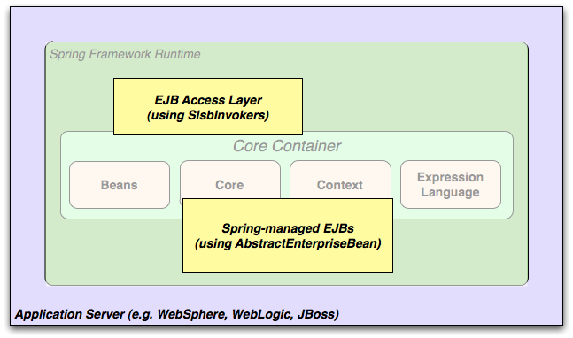

# Introduction to Spring Framework

### Dependency Injection and Inversion of Control (依赖注入和控制反转)
* Java应用程序
    * 是一个很宽松的术语，它可能是一个很简单的小程序，也可能是一个n层的服务器端企业级应用程序；
    * 通常由协作形成应用程序的对象组成。因此，应用程序中的对象具有彼此依赖的特性
    * 尽管Java平台提供了丰富的应用程序开发功能，但它缺少将基本组件组织成一个整体的手段，架构师和开发人员必须考虑这个问题
    * 尽管我们可以使用设计模式，如工厂、抽象工厂、生成器、装饰器和服务定位器来组成构成应用程序的各种类和对象实例。 
        然而，这些模式只是：给定一个名称的最佳实践，描述模式的作用，应用它的地方，它解决的问题，等等。
        模式是形式化的最佳实践，您必须在应用程序中实现自己。
    * 控制反转
        * IoC : Spring Framework Inversion of Control
        * 控制反转组件通过提供将完全不同的组件组合成完全可用的来解决这个问题
        * Spring框架将形式化的设计模式编译为可以集成到自己的应用程序中的第一类对象

* 模块
    * Spring框架由组织成约20个模块的功能组成。
    * 这些模块可以大致划分为： 核心容器、数据访问/数据集成、Web、AOP(面向切面编程)、仪表、测试，如下图


* 核心容器：Core Container
    * 核心容器由
        * Core
        * Beans
        * Context 上下文
        * Expression Language 表达式语言
    * Core、Beans
        * 提供了框架的基础部分，包括了 依赖注入、控制反转 的特性
        * BeanFactory 是一个复杂的工厂模式的实现，它消除了工厂中的单例特性，并对配置、规范进行单独设置
    * Context
        * Context 模块建立在 Core、Beans 模块提供的实体基础之上，它是一种框架式地访问对象的方法，类似于 JNDI 注册表
        * Context 模块继承了 Beans模块的一些特性，并添加了国际化（如，资源捆绑等）支持、事件传播、资源加载、以及上下文的透明创建（如一个servlet容器）
        * 同时，Context 模块也支持 JaveEE的特性，比如EJB、JMX和基本远程处理
        * 接口 ApplicationContext 是 Context 模块的焦点
    * Expression Language 
        * 表达式语言模块提供了强力的表达式函数，用于在运行时查询和操作对象图
        * 它是JSP2.1 规范中规定的表达式语言（统一EL）的扩展
        * 该语言支持：获取属性值、属性分配、方法调用、访问数组上下文、集合和索引器、逻辑和算术运算符、命名变量、以及通过Spring的IoC容器中的名称检索对象、列表投影和选择、公共列表聚合

* 数据访问/集成：Data Access/Integration
    * 数据访问/集成 包括：
        * JDBC
        * ORM
        * OXM
        * JMS
        * Transaction 事务
    * JDBC
        * 提供了JDBC抽象层，消除了繁琐的 JDBC 编码、解析数据库
    * ORM
        * 为流行的对象关系映射API（JPA、JDO、Hibernate）提供数据集成层
        * 使用 ORM 包可以使用所有这些框架以及Spring提供的所有其他功能
    * OXM
        * 提供了一个抽象层，用以支持 Object/XML映射(如 JAXB、Castor、XMLBeans、JiBX、XStream)
    * JMS 
        * Java 消息传递服务
        * 包含了 用于生成和使用消息的功能
    * Transaction
        * 事务模块支持对实现特殊接口的类以及所有POJO（简单Java对象）的编程和声明式事务管理

* Web
    * Web层包含了 Web、Web-Servlet、WebSocket、Web-Portlet 模块
    * Web
        * 提供了基本的面向Web的集成功能，比如多部分文件上传功能和使用servlet监听器和面向Web的应用程序上下文来初始化IoC容器。
        * 还包含Spring的远程支持的Web相关部分
    * Web-Servlet 
        * 包含了 Web 的 MVC 实现
        * Spring的MVC框架提供了一个 业务代码、Web表单 之间清晰的分割，并且与Spring框架的所有其他功能相集成
    * Web-Portlet
        * 提供了在portlet环境中使用的MVC实现，以及Web-Servlet模块的功能。

* 面向切面编程和仪表 : AOP and Instrumentation
    * Spring的AOP模块提供了一个符合AOP联盟的面向切面的编程实现
    * 它允许自定义，比如定义 方法拦截器、切入点 ，以干净地解耦实现不同功能模块的代码
    * 内部包含了 Aspects模块，用以提供与AspectJ的集成。
    * Instrumentation 模块提供了类仪表支持和类加载器实现，以用于某些特定的服务端应用程序

* 测试: Test
    * 测试模块支持使用 JUnit、TestNG 组件来测试 Spring 组件
    * 它提供了Spring ApplicationContext的一致加载和这些上下文的缓存
    * 同时提供模拟对象，以此来单独测试自己的代码

* 使用场景
    * 典型的、完整的 Spring Web 应用程序
        * Spring 的声明式事物管理特性使得 Web 应用程序完全地事务化，就像使用EJB容器管理的事务一样。
        * 所有自定义业务逻辑都可以通过简单的POJO来实现，并由Spring的IoC容器管理
        * 其他服务包括独立于Web层的发送电子邮件和验证的支持，允许选择执行验证规则的位置。
        * Spring的ORM集成了JPA，Hibernate和JDO; 例如，当使用Hibernate时，可以继续使用现有的映射文件和标准的Hibernate SessionFactory配置。
        * 表单控制器将Web层与域模型无缝集成，无需ActionForms或将HTTP参数转换为域模型值的其他类。
        
    * Spring中间层使用第三方Web框架
        * Spring并不强迫开发人员必须在一个WebApplication中的任何方面都使用Spring的组件
        * 使用Structs、Tapestry、JSF或者其他UI框架构建的现有前端可以与基于Spring的中间层集成
        
    * 远程使用
        * 当需要通过WebService访问现有的代码时，可以通过 HessianFactory、BurlapFactory、RmiFactory、JaxRpcFactory 类来实现
        
    * EJBs 包装现有的 POJOs
        * Spring框架提供了对JavaBeans访问和抽象层，使得开发人员可以重用已存在的POJOs、并将它们包装在无状态会话bean中，以用于可能需要声明性安全性的可扩展，故障安全的Web应用程序。
        

* 依赖管理以及命名约定
    * 依赖管理和依赖注入是不同的东西。
    * 为了使用这些特性（比如依赖注入），在运行时、甚至编译时需要将所有的jar包都包含在classpath中。通常情况下这些依赖关系不是注入的虚拟组件，而是文件系统中的物理资源
    * 依赖管理涉及到定位、保存这些资源，以及添加它们到classpath中。
    * Maven 依赖管理
        * 如果使用 Maven 作为依赖管理工具，那么就没必要显式提供日志依赖。
        * 例如，创建一个应用程序上下文并使用依赖注入去配置一个应用程序，那么 pom.xml 的依赖可以写做：
        ```xml
        <!-- Maven Central repository. -->
        <dependency>
            <groupId>org.springframework</groupId>
            <artifactId>spring-context</artifactId>
            <version>4.0.6.RELEASE</version>
            <scope>runtime</scope>
        </dependency>
        <!-- 使用 Spring 的Maven仓库 -->
        <repositories>
            <repository>
                <id>io.spring.repo.maven.release</id>
                <url>http://repo.spring.io/release/</url>
                <snapshots><enabled>false</enabled></snapshots>
            </repository>
        </repositories>
        ```
        * 另外，在使用Maven时，可能会混合使用不同版本的Spring的Jar包（比如项目本身的代码使用了Spring的较新版本，但是该项目依赖的另一个组件使用了Spring的较旧版本）
            这时候如果忘记显式声明一个直接依赖，可能会出现各种意想不到的问题。
        * 为了解决这个问题，Maven支持“物料清单”（bill of materials. BOM）依赖。可以通过插入 spring-framework-bom 依赖管理模块来保证 Spring 版本的一致性
        ```xml
        <dependencyManagement>
            <dependencies>
                <dependency>
                    <groupId>org.springframework</groupId>
                    <artifactId>spring-framework-bom</artifactId>
                    <version>4.0.6.RELEASE</version>
                    <type>pom</type>
                    <scope>import</scope>
                </dependency>
            </dependencies>
        </dependencyManagement>
        <!-- 当使用了这个依赖管理工具，则不需要再在使用 spring 组件依赖时指定version -->
        <dependencies>
            <dependency>
                <groupId>org.springframework</groupId>
                <artifactId>spring-context</artifactId>
            </dependency>
            <dependency>
                <groupId>org.springframework</groupId>
                <artifactId>spring-web</artifactId>
            </dependency>
        <dependencies>
        ```
    * 可以手动下载 Spring 的jar包 <http://repo.spring.io/release/org/springframework/spring/4.0.6.RELEASE/>

* 日志 Logging
    * 日志组件是一个非常重要的依赖，因为
        * 它是Spring唯一一个强制性的外部依赖
        * 大家都想看他们使用的工具的输出信息
        * Spring集成了许多其他工具，这些工具也有日志的依赖性
    * Spring中强制性的日志依赖是 Jakarta Commons Logging API (JCL)


### 一些关键名词的解释
* 依赖注入与控制反转
    * 现在稍微复杂的项目都需要多个类通过彼此的合作来实现业务逻辑，这使得每个对象都需要获取到与它合作的对象的引用。
    * 如果获取引用这个过程靠对象自身实现，那么会导致代码高度耦合，并且难以测试
    * 如果在对象被创建的时候，由一个调控系统（包含了所有对象的外界实体）将其所依赖的对象的引用传递给它，将会避免以上描述的问题
    * 依赖注入：某类需要的其他对象的引用被调度系统注入到该类中
    * 控制反转：本身，对象需要自己找到其他对象的引用；现在这个查找过程交给了某一特定的调度系统来实现，即如何获取对象所依赖的对象的引用，这个责任的反转。
    * 代码举例：
    ```java
    class A{
        InterfaceA a;
        AMethod(){
            a = new InterfaceAImp();            // 即 a 需要被赋值为 实现InterfaceA接口的某类的对象
        }
    }
    // 这时候，类A就依赖于 InterfaceA；如果想要使用 InterfaceA的另外一个实现（ InterfaceAImpxxx ），就需要修改代码。
    // 这时候虽然可以建立一个Factory来根据条件生成想要的 InterfaceA 的具体实现，如下：
    InterfaceImplFactory{
        AInterface create(Object condition){
            if(condition == condA){
                return new AInterfaceImpA();
            }else if(condition == condB){
                return new AInterfaceImpB();
            }else{
                return new AInterfaceImp();
            }
        }
    }
    // 但是本质上并没有解除掉 A 和 InterfaceA的实现 之间的耦合关系。特别地，用户无法自定义一个 InterfaceA 的实现并传给A。
    // 这时候，可以使用 IoC（依赖注入），将耦合从代码中移出来，放到统一的XML文件中；再通过一个容器，在需要的时候把这个具体的 InterfaceA的实现的对象赋值给 a，即可完全实现解耦
    // 本质上来说，就是通过一个配置文件，最大程度地定制赋值给 a 的对象到底是 InterfaceA 的哪个实现
    ```


