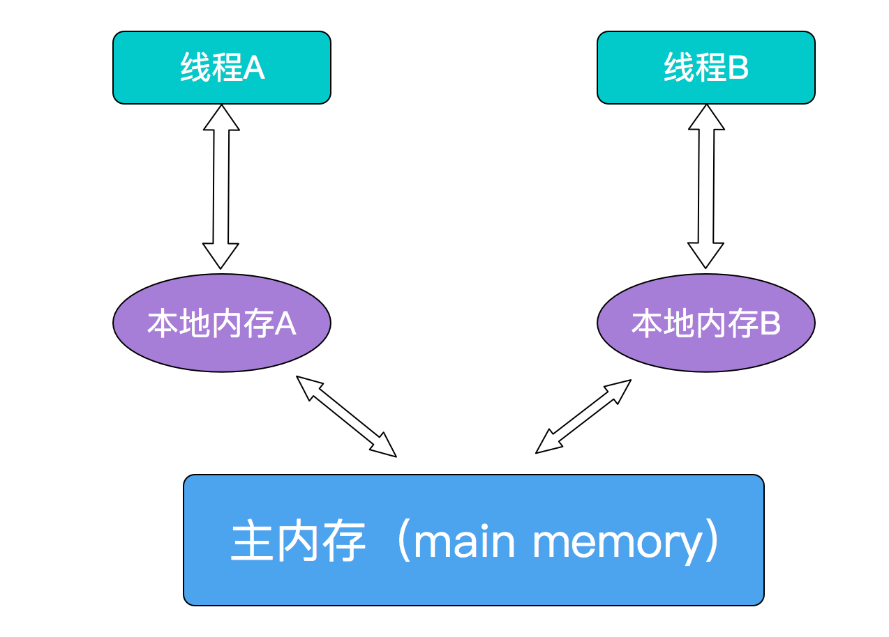

# 对象及斌量的并发访问

## synchronized 同步

* synchronized 方法是同步的，但是要注意，该同步是针对共享对象来说的
    * 即如果存在方法 method() 被 synchronized 修饰，则
        * 情景一：多个线程访问相同的共享对象，则 method() 方法将会同步执行
        ```java
        A a = new A();
        Thread thread1 = new Thread(a);
        Thread thread2 = new Thread(a);
        thread1.start();
        thread2.start();
        // method 为同步执行
        ```
        * 情景二：多个线程访问不同的共享对象（各自访问各自的），则 method() 方法将会异步执行
        ```java
        Thread thread1 = new Thread(new A());
        Thread thread2 = new Thread(new A());
        thread1.start();
        thread2.start();
        // method 为异步执行
        ```

* synchronized 的本质即为加锁，即为对象增加一个锁，同一时刻只能有一个线程访问这个代码块
    * 但是要注意，一个对象中即使包含了多个 synchronized 方法，也只会产生一个锁。
    * 也就是说，对于共享对象来说，如果 methodA 和 methodB 都被 synchronized 修饰，
        如果线程 A 进入了 methodA 方法，那么在 methodA 执行期间，任意其他线程都无法进入 methodB 方法
    * 即， synchronized 加的锁是针对于对象而加的
    ```java
    public class SynchronizedCallTest {
        public static class Tmp{
            private static void printStr(String sign){
                System.out.println( "start "+sign );
                try { Thread.sleep( 1000 ); } catch (InterruptedException e){ e.printStackTrace(); }
                System.out.println( "end "+sign );
            }
            synchronized public void methodA(){ printStr("A"); }
            synchronized public void methodB(){ printStr("B"); }
        }
        public static class ThreadA extends Thread{
            private Tmp tmpObj;
            public ThreadA( Tmp tmpObj ){ this.tmpObj = tmpObj; }
            @Override
            public void run(){ tmpObj.methodA(); }
        }
        public static class ThreadB extends Thread{
            private Tmp tmpObj;
            public ThreadB( Tmp tmpObj ){ this.tmpObj = tmpObj; }
            @Override
            public void run(){ tmpObj.methodB(); }
        }

        public static void main(String[] args){
            Tmp tmp = new Tmp();
            new ThreadA(tmp).start();
            new ThreadB(tmp).start();
        }
    }
    ```

* synchronized 具有锁重入的特性
    * 可重入锁
        * 对于共享对象来说，如果 methodA 和 methodB 都被 synchronized 修饰，
            如果线程 A 进入了 methodA 方法，那么在 methodA 执行期间，线程 A 可以访问该对象内任意其他的 synchronized 方法。
        * 因为此时线程 A 具有了该对象的锁，再次申请锁时总是可以获取到该锁
    * 与 “可重入锁” 对应的是 “不可重入锁”
        * 不可重入锁 即为：即使线程 A 当前持有某对象的锁，线程 A 也不可再去申请该锁；若是继续申请该锁，则会造成死锁

* 注意，当一个线程执行的代码出现异常时，其所持有的所有锁都将会自动释放

* synchronized 的其他特性
    * 父、子 synchronized 方法对于锁的继承性
        * 假设父类有 synchronized 方法 methodA ，继承自该父类的子类中又实现了 synchronized 方法 methodB
        * 那么当子类对象在调用 methodB 的过程中，调用了 methodA ，那么也将可以直接获取锁
    * synchronized 方法的 synchronized 性质不具有继承性
        * 假设父类有 synchronized 方法 methodA ，继承自该父类的子类无论是重载还是重写了方法 methodA 
        * 则子类的 methodA 都不具有同步性；如果需要为其添加同步性，则需要使用 synchronized 为子类的 methodA 方法进行修饰
    * synchronized 除了可以修饰对象外，还可以修饰类，且它们并非相同的锁
        * 假设类 A 有 synchronized static 方法 methodA ，有 synchronized 方法 B
        * 那么 A.methodA() 与 a.methodB() 将可以进行异步调用
        * 按照 java 中一切皆为对象的思想，类本身就是一个对象，因此它也可以拥有锁，也可以执行上锁操作（注意区分类对象和类的对象）

* 多线程死锁的经典场景
    * 一共有两个线程 A B 以及两个锁 lockA lockB。在某时刻，
        A 获取到了 lockA 并试图获取 lockB；与此同时， B 获取到了 lockB 并试图获取 lockA；此时这两个线程即为互相等待，陷入死锁


## synchronized 与 volatile 的对比

* synchronized
    * 某一个线程进入synchronized代码块前后，执行过程入如下：
        * 线程获得互斥锁
        * 清空工作内存
        * 从主内存拷贝共享变量最新的值到工作内存成为副本
        * 执行代码
        * 将修改后的副本的值刷新回主内存中
        * 线程释放锁
        * 随后，其他代码在进入 synchronized 代码块的时候，所读取到的工作内存上共享变量的值都是上一个线程修改后的最新值。

## volatile

* volatile 是 Java 提供的一种轻量级的同步机制，在并发编程中，它也扮演着比较重要的角色。
    * 同 synchronized 相比（synchronized通常称为重量级锁），volatile 更轻量级

* volatile 是一种轻量级的同步机制，它主要有两个特性：
    * 一是保证共享变量对所有线程的可见性
    * 二是禁止指令重排序优化
    * 同时需要注意的是，volatile对于单个的共享变量的读/写具有原子性，但是像num++这种复合操作，volatile无法保证其原子性
    * 当然，可以使用并发包中的原子操作类，通过循环CAS地方式来保证num++操作的原子性

* 关于"保证共享变量对所有线程的可见性" ，要从JVM说起
    * JMM决定一个线程对共享变量的写入何时对另一个线程可见。
    * JMM定义了线程和主内存之间的抽象关系：共享变量存储在主内存(Main Memory)中，每个线程都有一个私有的本地内存（Local Memory），本地内存保存了被该线程使用到的主内存的副本拷贝，线程对变量的所有操作都必须在工作内存中进行，而不能直接读写主内存中的变量。
    * 这三者之间的交互关系如下
    * 
    * 此时，如果针对某变量添加 volatile ，则具有以下功能
        * 当写一个 volatile 变量时，JMM 会把该线程对应的本地内存中的变量强制刷新到主内存中去；
        * 这个写会操作会导致其他线程中的缓存无效。

* volatile 适用情况
    * 对变量的写入操作不依赖当前值
        * 比如自增自减、number = number + 5等（不满足）
    * 当前volatile变量不依赖于别的volatile变量
        * 比如 volatile_var > volatile_var2这个不等式（不满足）

* volatile 修饰符的有过什么实践
    * 用 volatile 修饰 long/double 变量，使其能按原子类型来读写
        * double/long 都是64位宽，读取过程是分为两部分的，先读第一个 32 位，然后再读剩下的 32 位，这个过程不是原子的
        * 但 Java 中 volatile 型的 long/double 变量的读写是原子的
    * volatile 修复符的另一个作用是提供内存屏障（memory barrier）
        * 就是当你写一个 volatile 变量之前，Java 内存模型会插入一个写屏障（write barrier）
        * 读一个 volatile 变量之前，会插入一个读屏障（read barrier）
        * 即可以保证 任何线程都能看到你写的值，同时，在写之前，也能保证任何数值的更新对所有线程是可见的

## volatile 与 synchronized

* volatile 不需要同步操作，所以效率更高，不会阻塞线程，但是适用情况比较窄
* volatile 读变量相当于加锁（即进入synchronized代码块），而写变量相当于解锁（退出synchronized代码块）
* synchronized 既能保证共享变量可见性，也可以保证锁内操作的原子性；volatile只能保证可见性

## 线程安全性

* 线程安全(Thread-safe)的集合对象
    * Vector
    * HashTable
    * StringBuffer

* 非线程安全的集合对象
    * ArrayList
    * LinkedList
    * HashMap
    * HashSet
    * TreeMap
    * TreeSet
    * StringBulider
