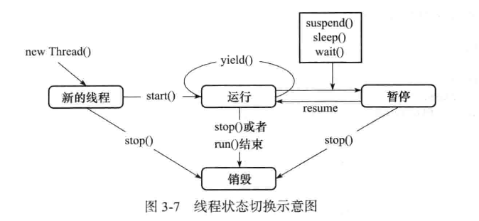

# 线程间通信

## 等待/通知机制

* 如果没有线程间通知机制，则一个线程要想要获取另一个线程的当前执行状态，只能通过轮询来进行判断
    * 如果轮询时间间隔较小，很容易造成 CPU 资源的浪费
    * 如果轮询时间间隔交大，很容易造成取不到希望拿到的数据

* 等待/通知 机制
    * wait 与 notify
        * wait 使得线程阻塞，停止运行
        * notify 使得处于 wait 状态的线程继续运行
    * wait() 的作用是使当前执行代码的线程进行等待；
        * 它将会使当前线程进入 “预执行队列”，并在 wait() 所在的位置停止执行
        * 直到接到通知或被中断为止
    * 调用 wait() 方法之前，线程必须先获得该对象的对象级别锁；
        * 即只能在同步方法或者同步代码块中执行 wait() 方法
        * 执行 wait() 方法之后，当前线程释放锁
        * 在从 wait() 返回前，线程与其他线程竞争重新获得锁
        * 如果在执行 wait 方法之前没有持有适当的锁，则将会抛出异常： IllegalMonitorStateException (运行时异常，无需 try-catch)
    * notify() 
    * 调用 notify 方法之前，线程也必须先获得该对象的对象级别锁
        * 如果在执行 notify 方法之前没有持有适当的锁，则将会抛出异常： IllegalMonitorStateException (运行时异常，无需 try-catch)
        * 该方法用来通知那些可能等待该对象的对象锁的线程；
            如果存在多个线程在等待，则线程规划器会随机选择一个呈 wait 状态的线程，对其发出通知 notify；并使它等待获取该对象的对象锁
        * 注意，在执行 notify() 方法之后，当前线程将会在执行完当前的同步代码块之后，才会归还对象锁
        * 当第一个获取对象锁的 wait 线程执行完毕之后，对象锁将会被释放；
            此时如果该 wait 线程没有再次发出 notify 通知，则即使当前对象锁是空闲状态，其他 wait 线程由于没有收到 notify 通知，
            也仍旧会处于 wait 阻塞状态；直到有其他线程再次发出 notify 或者 notifyAll 通知

* 简单实例
```java
public class WaitAndNotify {
    public static class ThreadA extends Thread{
        private final Object lock;
        public ThreadA(Object lock){ this.lock = lock; }
        @Override
        public void run(){
            try{
                System.out.println( "before wait" );
                synchronized (this.lock){ this.lock.wait(); }
                System.out.println( "after wait" );
            }catch (InterruptedException e){ e.printStackTrace(); }
        }
    }
    public static class ThreadB extends Thread{
        private final Object lock;
        public ThreadB(Object lock){ this.lock = lock; }
        @Override
        public void run(){
            System.out.println( "before notify" );
            synchronized (this.lock){ this.lock.notify(); }
            System.out.println( "after notify" );
        }
    }
    public static void main(String[] args) throws Exception{
        Object lock = new Object();
        ThreadA threadA = new ThreadA( lock );
        ThreadB threadB = new ThreadB( lock );
        threadA.start();
        Thread.sleep( 2000 );
        threadB.start();
    }
}
```

* 线程状态切换示意图
    * 
    * 注意 Running 状态与 Runnable 的状态
        * yield 将会使得 Running 状态的线程变成 Runnable 状态
        * start 也是先将线程置为 Runnable 状态，然后等待线程调度器来进行调度
        * 调用了 suspend 的线程在被 resume 之后，也将会处于 Runnable 状态
        * 当线程正常执行时，因为系统整体的任务调度切换，导致 Running 状态的线程被切换到 Runnable 状态
        * 调用 sleep 命令之后经过的时间超过了设置的超时时间，此时线程将处于 Runnable 状态，等待线程调度器进行后续调度
        * 线程调用阻塞 IO 的操作，在阻塞 IO 操作返回之后，处于 Runnable 状态
    * Blocked 阻塞状态，即通知 CPU，当前线程不需要 CPU 资源，在等待或做其他事儿，无需进行调度
        * 线程调用 sleep 命令，经过时间尚未超出设置的超时时间时，此时线程处于 Blocked
        * 线程调用阻塞 IO 的操作，在阻塞 IO 操作返回之前，处于 Blocked
        * wait 线程在尚未等到 notify 通知时，处于 Blocked
        * 线程使用 suspend 方法之后，将线程挂起

* 当 interrupt 方法遇到 wait 方法
    * 当一个处于 wait 状态的线程被调用 interrupt 方法之后，将会抛出 InterruptedException 异常

* wait() 方法 与 wait(long) 方法
    * wait() 方法将会阻塞，直到收到 notify 通知，变为 Runnable
    * wait(long) 方法将会阻塞
        * 如果再 long 所指示的时间范围之内，收到 notify 通知，则该线程将会 Runnable
        * 如果再 long 所指示的时间范围之内，没有收到 notify 通知，则线程也会在 long 时间段之后，自动变为 Runnable

## 管道通信

* java 中提供了各种各样的输入输出流，方便我们进行数据操作；
    而管道流( pipeStream )是一种特殊的流，用在不同的线程之间直接传输数据

* pipeStream
    * 一个线程向管道中写入数据，一个线程从管道中读取数据
    * 直接实现线程间数据的交换，而不需要临时文件等手段

* pipeStream 常用的类
    * PipedInputStream / PipedOutputStream
        * 字节流
    * PipedReader / PipedWriter
        * 字符流

* 简单的使用实例

```java
public class PipInputOutput {
    public static class WriteData{
        public void writeMethod(PipedOutputStream out){
            try {
                System.out.println( "write" );
                for ( int i = 0 ; i < 100; i ++ ){
                    String tmpData = "" + i;
                    out.write( tmpData.getBytes() );
                }
                out.close();
            }catch (IOException e){ e.printStackTrace(); }
        }
    }
    public static class ReadData{
        public void readMethod(PipedInputStream input){
            try {
                System.out.println( "read" );
                byte[] byteArr = new byte[21];
                int readLength = input.read( byteArr );
                while ( readLength != -1 ){
                    String inputStr = new String( byteArr,0,readLength );
                    System.out.print( inputStr + " " );
                    readLength = input.read( byteArr );
                }
                input.close();
            }catch (IOException e){ e.printStackTrace(); }
        }
    }
    @AllArgsConstructor
    public static class ThreadWrite extends Thread{
        private WriteData writeData;
        private PipedOutputStream outputStream;
        @Override
        public void run(){
            this.writeData.writeMethod( outputStream );
        }
    }
    @AllArgsConstructor
    public static class ThreadRead extends Thread{
        private ReadData readData;
        private PipedInputStream inputStream;
        @Override
        public void run(){
            this.readData.readMethod( inputStream );
        }
    }
    public static void main(String[] args) throws Exception{
        WriteData writeData = new WriteData();
        ReadData readData = new ReadData();
        PipedOutputStream outputStream = new PipedOutputStream();
        PipedInputStream inputStream = new PipedInputStream();

        // 将 outputStream 与 inputStream 进行关联。
        // 即当 outputStream 写完（调用 close 方法）之后，inputStream 将会收到消息，进行数据读取
        // 换而言之，即使线程先自行 read 操作，但是因为 outputStream 尚未就绪，这 read 方法将会被阻塞
        outputStream.connect( inputStream );

        ThreadWrite threadWrite = new ThreadWrite( writeData,outputStream );
        ThreadRead threadRead = new ThreadRead( readData,inputStream );
        threadRead.start();
        Thread.sleep(2000);
        threadWrite.start();
    }
}
```

## join

* 很多时候，需要在某线程中得到另一线程的计算结果（返回值），
    那么此时就要保证该线程一定要等待另一线程计算完毕之后再做后续的处理；
    这种场景下，就应使用 join

* join 方法的作用，即为阻塞当前进程，直到目标线程执行结束，当前进行被唤醒进行后续处理

```java
public static void main(String[] args){
    MyThread thread = new MyThread();
    thread.start();
    thread.join();
    System.out.println( "current thread has finished" );
}
```

* join() 与 join(long) 的区别
    * 类似于 wait() 和 wait(long)，join也是代表无限期等待，join(long)代表最长等待时间

* join(long) 与 sleep(long) 的区别
    * join(long) 内部使用 wait(long) 来实现，在调用之后将会释放对象锁
    * sleep(long) 在调用后将不会释放对象锁

## ThreadLocal 的使用

* 变量值的共享，可以使用 public static 来实现（类对象的参数，因此进程内唯一，线程间共享）；
    如果每个线程都希望有一个自己的共享变量，那么可以使用 ThreadLocal

* ThreadLocal 解决的是，变量在线程间的隔离性（即每个线程都可以对其进行读写，线程之间的读写互不影响）

* ThreadLocal 主要通过以下两个方式来使用
    * ThreadLocal 最好定义为 `public static` 方便其他线程取用，以及全局的一致性
    * `object tl.get()` 方法将会返回上一次 set 进去的值；如果尚未进行 set， 则返回 null
    * `tl.set(object)`  方法将会为 ThreadLocal 对象设置当前值
    * ThreadLocal 对象可以通过重写 initialValue 方法，为每个线程设置初始默认值
        * 注意， initialValue() 将会在每个线程第一次访问 tl 对象时进行调用，且为该线程设置默认值
        * 也就是说，并非每个线程取到的默认值都是一样的

```java
public class Tool{
    public static ThreadLocal tl = new ThreadLocal();
}
public static void main(String[] args){
    if ( tl.get() == null ){
        tl.set("current has no value");
    } else {
        tl.set("current has value");
    }
}

public class ThreadLocalWithDefault extends ThreadLocal{
    @Override
    protected Object initialValue(){
        return new Date().getTime();
    }
}
```


