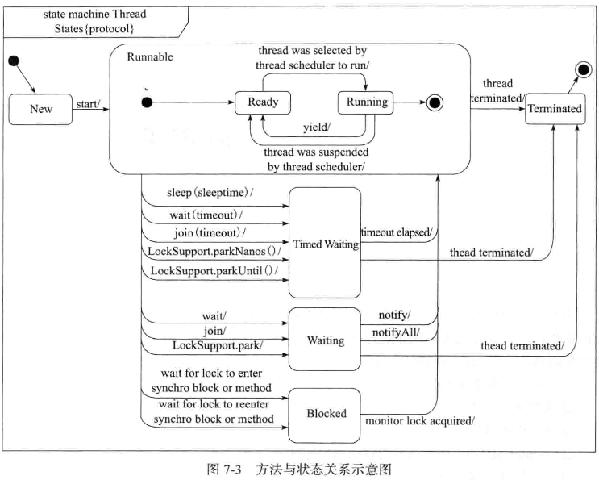
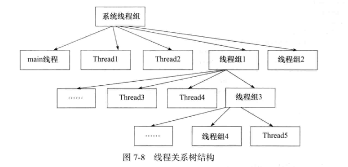

# 查漏补遗

## 线程的状态

* 线程的状态，可以使用 State 类来标识

```java
public enum State {
    NEW,            // 线程对象被创建，处于初始化阶段
    RUNNABLE,       // Runnable 阶段，等待线程调度器去进行调度
    BLOCKED,        // 等待锁阶段，比如未获取到 synchronized 代码块锁对象的线程的状态
    WAITING,        // 阻塞状态，比如调用了 wait()/join() 等方法
    TIMED_WAITING,  // 时效阻塞状态，比如调用了 wait(long)/join(long) 等方法
                    // 本身可以被其他线程所唤醒，也会因为经过等待时间之后自动唤醒
    TERMINATED;     // 停止状态，比如线程已经执行完毕的状态
}
```

* 它们至今的状态转换可用下图来描述
    * 

## 线程组

* 可以把线程归属到某个线程组中；线程组中可以有线程对象，也可以有线程组；
    * 如下：
    
    * 线程组可以批量地管理线程对象，有效地对其进行组织
    * ThreadGroup 对象
    ```java
    ThreadGroup group = new ThreadGroup("线程组测试");
    Thread threada = new Thread(group,aRunnable);
    Thread threadb = new Thread(group,bRunnable);
    threada.start();
    threadb.start();
    System.out.println( "活动的线程数为： "+group.activeCount() );
    System.out.println( "线程组的名称为： "+group.getName() );
    ```

## SimpleDateFormat 非线程安全

* SimpleDateFormat 本身是非线程安全的，因此如果要在多线程的场景下使用，就需要注意线程问题
    * 可以使用 ThreadLocal 来解决这个问题

```java
public class DevTool{
    private static ThreadLocal<SimpleDateFormat> tl = new ThreadLocal<SimpleDateFormat>();
    private static SimpleDateFormat getSimpleDateFormatObj(String datePattern){
        SimpleDateFormat sdf = null;
        sdf = tl.get();
        if ( sdf == null ){
            sdf = new SimpleDateFormat(datePattern);
            tl.set(sdf);
        }
        return sdf;
    }
}
```

## 对线程内的异常进行捕获

* 对线程内的异常进行捕获
    * 使用 setUncaughtExceptionHandler 方法，为线程设置默认的异常处理类

```java
MyThread thread = new Mythread();
thread.setName("会产生异常的线程");
thread.setUncaughtExceptionHandler(new UncaughtExceptionHandler(){
    @Override
    public void uncaughtException( Thread t,Throwable e ){
        System.out.println("线程 " + t.getName() + " 产生异常");
        e.printStackTrace();
    }
})
thread.start();
```


