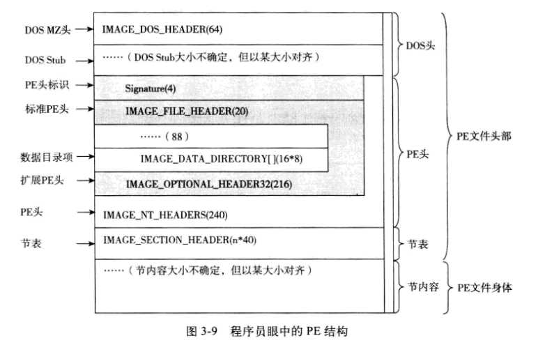

# 文件头

## 基础概念

* PE 中存在的几种地址
    * 虚拟内存地址 (VA)
        * 用户的PE文件被加载到内存之后，PE对应的进程支配了自己独立的4GB内存空间。
        用于在该空间内进行定位的地址叫做虚拟内存地址
        * 地址范围: 0x00000000~0xFFFFFFFF
        * PE 文件中，进程的 VA = 进程的基地址+相对虚拟内存地址
    * 相对虚拟内存地址 (RVA)
        * 一个进程在被加载到虚拟内存之后，其相关的动态链接库也会被加载（该动态链接库被称为模块）
        操作系统决定了每个模块在 4GB 内存中的地址，该地址称为模块的基地址。
        * RVA 即为某模块中相对于该模块基地址的偏移
        * RVA 是相对于某特定模块而言的，因此它会有一个范围（任一模块都会有起止范围），
        超过该返回的 RVA 是无意义的，被称为越界
        * 
    * 文件偏移地址 (FOA)
        * 文件偏移地址与内存无关，它是距离文件头的偏移量
    * 特殊地址
        * 某些特定地址才会用该类型地址（如资源表）

* PE 中有一个结构称为数据目录，记录了所有可能存在的数据类型，目前已定义的包括十五种：
	* 导出表(.edata)
	* 导入表(.idata)
	* 资源表(.rsrc)
	* 异常表(.pdata)
	* 安全表(文件偏移)
	* 重定位表(.reloc)
	* 调试表(.debug)
	* 版权表(必须为0)
	* 全局指针表: 将被存储在全局指针寄存器中的一个值的RVA
	* 线程本地存储表(.tls)
	* 加载配置表
	* 绑定导入表
	* IAT表
	* 延迟导入表
	* CLR表(.cormeta)
	* 预留

* 节: 存放不同类型数据的地址
    * 存放的可能为
        * 代码
        * 数据
        * 常量
        * 资源
    * 节是存放数据或者代码的基本单元
    * 一个节中的所有原始数据必须被加载到连续的内存中
    * 节的属性可能是: 只读、只写、可读、可写

* 对齐
    * 内存对齐
        * 对于32位系统而言，对齐基准为 4kb
        * 对于64位系统而言，对齐基准为 8kb
    * 文件对齐
        * 一般为 512 字节对齐
    * 资源数据对齐
        * 一般为 4 字节对齐

## PE 整体结构

* 

